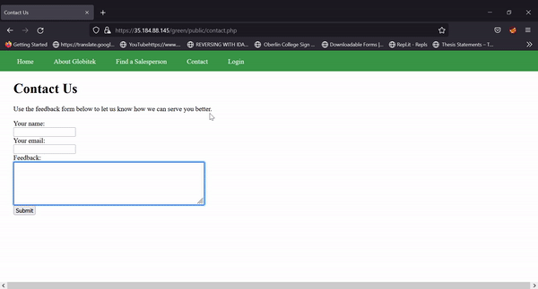
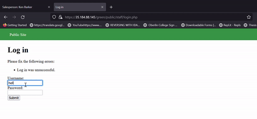
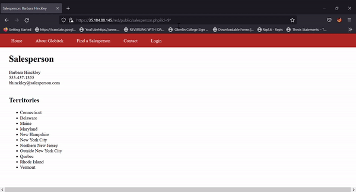
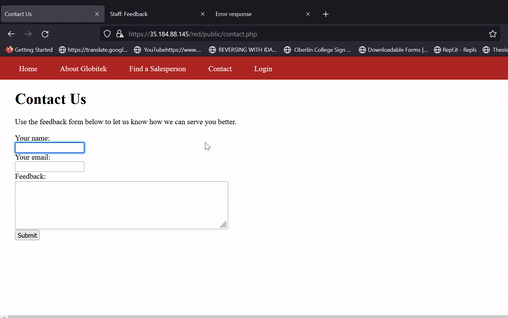

# Project 9 - Pentesting Live Targets

Time spent: **24** hours spent in total

> Objective: Identify vulnerabilities in three different versions of the Globitek website: blue, green, and red.

The six possible exploits are:

* Username Enumeration
* Insecure Direct Object Reference (IDOR)
* SQL Injection (SQLi)
* Cross-Site Scripting (XSS)
* Cross-Site Request Forgery (CSRF)
* Session Hijacking/Fixation

Each color is vulnerable to only 2 of the 6 possible exploits. First discover which color has the specific vulnerability, then write a short description of how to exploit it, and finally demonstrate it using screenshots compiled into a GIF.

## Blue

Vulnerability #1: SQL injection

Description: The website is vulnerable to SQL injection at /public/salesperson.php?id=x

1. /blue/public/salesperson.php?id=x, we ca use blind injection to look see the data

* Payload: x' union select 1, 2, 3, table_name, sleep(2) from information_schema.tables where table_name LIKE 'payload%';-- -

2. /blue/public/staff/salespeople/show.php?id=

* Payload: ' union select 1, hashed_password, username, 4, 5 from users where username='jmonroe99';-- -
    ===> Allow us to fetch all username and password

Vulnerability #2: Session Hijacking

Description: We can hijack red/public/staff/index by change the current PHP cookie on Firefox and reload the page on Chrome

* login as a staff in Firefox then refresh the page on Chrome

## Green

Vulnerability #1: XSS

Description: a stored XSS can be inject through /green/public/contact.php in name and feedback input

* Payload: 

Vulnerability #2: User Enumeration

Description: At /green/public/login.php if the usernam exists, then the word is bold => we can see the differences

## Red

Vulnerability #1: IDOR

Description: We can access /red/public/salesperson.php?id=10 with not redirect to /red/public/territories.php

Vulnerability #2: CSRF

Description: Host a server with your computer and give the address of the form to /red/public/contact.php
             When the user go to the link, the address going to redirect them to https://35.184.88.145/red/public/staff/salespeople/edit.php?id=5 with a POST
             ==> modified the data at id=5

